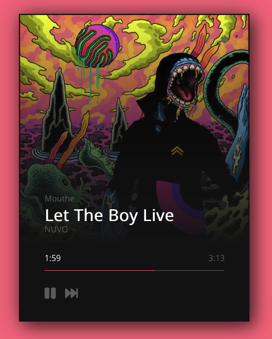

# Yandex Radio Background Player Remote

This is a basic html/js implementation of a remote controller for [Yandex Radio Background Player](https://github.com/ivanrussu/yandex_radio_background_player).

Inspired by https://dribbble.com/shots/2132841-Day-005-Music-Player

Based on https://codepen.io/ixahmedxi/pen/YNPVwo

## Usage

Just open index.html in browser, set address of websoket server and click save.